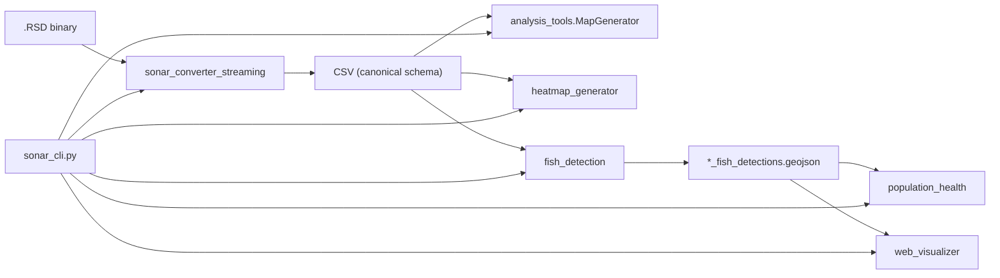

# Architecture

Garmin Sonar RSD Converter is a stdlib-only Python CLI that transforms proprietary
Garmin `.RSD` sonar recordings into CSV and downstream geospatial exports.

## Data Flow



## Canonical CSV Schema

The streaming converter (`sonar_converter_streaming.py`) is the single source of truth
for CSV output. Columns are defined in `sonar_schema.CSV_COLUMNS`:

| Column | Description |
|--------|-------------|
| `frame_number` | Frame index derived from byte offset |
| `offset` | Byte offset in the RSD file |
| `latitude` | WGS84 latitude (degrees) |
| `longitude` | WGS84 longitude (degrees) |
| `depth_m` | Water depth in meters |
| `water_temp_c` | Water temperature (°C) |
| `sonar_frequency_khz` | Sonar frequency (kHz) |
| `sonar_intensity_avg` | Mean intensity across samples in frame |
| `sonar_intensity_max` | Peak intensity in frame |
| `sonar_intensity_count` | Number of intensity samples (maps to PLY `beam_count`) |

All downstream modules parse rows through `sonar_schema.parse_sonar_row()` to ensure
consistent GPS validation and field normalization.

## RSD Parsing

Parsing is **heuristic**, not based on a published Garmin specification. The streaming
parser scans the file at a configurable byte stride (default 256) and unpacks fixed
offsets for GPS, depth, temperature, frequency, and intensity arrays.

For reproducible testing, `fixtures/generate_sample_rsd.py` writes synthetic RSD files
using the same byte layout expected by the parser.

## Module Responsibilities

| Module | Role |
|--------|------|
| `sonar_cli.py` | CLI entry point, logging setup, pipeline orchestration |
| `sonar_schema.py` | CSV schema, row parsing, streaming statistics, disclaimers |
| `sonar_converter_streaming.py` | Active RSD → CSV converter (low memory) |
| `sonar_converter.py` | Deprecated wrapper delegating to streaming parser |
| `analysis_tools.py` | GeoJSON, KML, GPX, PLY exports |
| `heatmap_generator.py` | Intensity, depth, temperature GeoJSON heatmaps |
| `fish_detection.py` | Heuristic intensity signature detection |
| `population_health.py` | Composite heuristic scores and markdown reports |
| `web_visualizer.py` | Self-contained HTML dashboard with Leaflet map |

## Heuristic Analysis Disclaimer

Fish detection and population health modules classify sonar intensity patterns using
fixed thresholds. Outputs are exploratory and must not be treated as biological
identification or fisheries survey data. See `sonar_schema.HEURISTIC_DISCLAIMER`.

## Testing

- `test_converter.py` — schema, exports, parser round-trip, CLI smoke tests
- `fixtures/generate_sample_rsd.py` — synthetic RSD generator for CI and local demos
- `.github/workflows/ci.yml` — Python 3.8/3.10/3.12 matrix, compile check, pipeline smoke test

## Logging

Logging is configured once via `sonar_schema.setup_logging()`, called from `sonar_cli.py`.
Library modules use `logging.getLogger(__name__)` only.

## Distribution

Install in editable mode:

```bash
pip install -e .
garmin-rsd --help
```

The console script `garmin-rsd` maps to `sonar_cli:main`.
