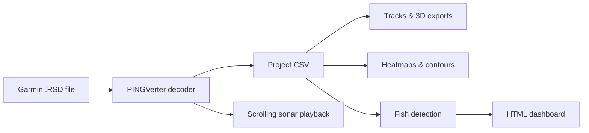

# Garmin Sonar RSD Converter

Convert Garmin `.RSD` sonar recordings into CSV, interactive maps, bathymetry exports, fish reports, shareable HTML dashboards, and **live-style sonar playback** you can watch like the unit display.

Built for anglers, lake surveyors, and anyone who wants to turn Garmin fish-finder recordings into GIS-friendly data without proprietary desktop software.

---

## How it works



1. **Decode** — [PINGVerter](https://pypi.org/project/pingverter/) parses the RSD binary format (documented Garmin structure, not byte-guessing).
2. **Normalize** — `pingverter_adapter.py` maps ping metadata and raw sample statistics into a stable CSV schema.
3. **Analyze** — Heatmaps, fish heuristics, quality scores, and map exports run from that CSV.

---

## Features

### Conversion & validation
- RSD → CSV via PINGVerter (`convert`)
- Pre-flight RSD validation without writing CSV (`convert --validate`)
- Track quality scoring on existing CSV (`analyze --quality`)

### Maps & bathymetry
- GPS tracks: GeoJSON, KML, GPX
- 3D point clouds: PLY, LAS, LAZ (LAZ needs optional `laszip` CLI)
- Bathymetry raster: GeoTIFF (WGS84)
- Gridded heatmaps: intensity, depth, temperature
- Depth contour lines (GeoJSON)

### Fish & reporting
- Heuristic fish detection by sonar intensity
- Fish school clustering and grid aggregation
- Population health score + markdown report
- Self-contained HTML dashboard (embedded Leaflet)

### Multi-survey workflows
- Merge multiple CSVs from one day (`merge`)
- Compare bathymetry between two surveys (`compare`)
- Batch folder/glob processing (`batch`)
- Local drag-and-drop web UI (`upload`)

### Sonar playback
- Live-style scrolling echogram from raw RSD (`playback`)
- Garmin palette, bottom track line, and telemetry HUD
- MP4 (requires `ffmpeg`), animated GIF, or interactive HTML player

---

## Requirements

- **Python 3.8+**
- **PINGVerter** and its dependencies (numpy, pandas, pyproj, pillow) — installed via `requirements.txt`

---

## Installation

```bash
git clone https://github.com/TheMitchyBoy/Garmin-RSD-Converter.git
cd Garmin-RSD-Converter
pip install -r requirements.txt
```

Optional for LAZ compression:

```bash
# Install laszip CLI separately if you want --maps laz output
```

Optional for MP4 sonar playback video:

```bash
# ffmpeg must be on your PATH for .mp4 output
ffmpeg -version
```

---

## Quick start

```bash
# 1. Validate an RSD before processing
python sonar_cli.py convert Sonar000.RSD --validate

# 2. Convert to CSV
python sonar_cli.py convert Sonar000.RSD

# 3. Check CSV quality
python sonar_cli.py analyze Sonar000.csv --quality

# 4. Full pipeline (CSV + maps + heatmaps + fish + dashboard)
python sonar_cli.py pipeline Sonar000.RSD --location "Lake Survey"

# 5. Watch the recorded sonar feed (scrolling echogram)
python sonar_cli.py playback Sonar000.RSD --output sonar.html
```

---

## Using your recorded sonar feed

Garmin units save sonar **recordings** as `.RSD` files on the chartplotter or fish finder. These files contain the raw ping-by-ping echogram data (what you saw scrolling on screen while recording), plus GPS, depth, temperature, and channel metadata.

### 1. Get the RSD file off your unit

Copy the recording from your Garmin device to your computer. Typical locations depend on model and storage:

| Source | Where to look |
|--------|----------------|
| SD/microSD card | `Garmin/` folder on the removable card — look for `Sonar*.RSD` or similar |
| Connected via USB | Device mass-storage mode — browse the unit's internal or SD storage for `.RSD` files |
| Already exported | Any folder where you copied recordings after a trip |

File names are often sequential (`Sonar000.RSD`, `Sonar001.RSD`, …). Each file is one recording session.

### 2. Validate before you process

```bash
python sonar_cli.py convert Sonar000.RSD --validate
```

This decodes the file and reports GPS, depth, and sample coverage. If the score is low, the recording may be incomplete or missing a GPS fix — playback may still work, but maps will be limited.

### 3. Watch the recording (live-style playback)

The `playback` command rebuilds the scrolling waterfall echogram from the raw pings — depth runs **top to bottom**, time scrolls **left to right** as new pings arrive, using Garmin-style colors.

**Interactive HTML player (recommended — no extra software):**

```bash
python sonar_cli.py playback Sonar000.RSD --format html --output sonar.html
```

Open `sonar.html` in any web browser. Use **Play/Pause**, drag the scrub bar to jump to any moment, and adjust playback speed.

**Shareable video (requires ffmpeg):**

```bash
python sonar_cli.py playback Sonar000.RSD --output sonar.mp4
```

**Animated GIF (no ffmpeg needed):**

```bash
python sonar_cli.py playback Sonar000.RSD --format gif --output sonar.gif
```

### 4. Reading the playback display

| Element | What it shows |
|---------|----------------|
| **Color waterfall** | Sonar return intensity — dark blue is weak, yellow/red/white is strong (fish, hard bottom, structure) |
| **Yellow bottom line** | Tracked lake/sea floor depth over time |
| **Top telemetry bar** | Channel name, depth, water temperature, elapsed recording time, ping counter |
| **Horizontal axis** | Time — newest pings appear on the right as the view scrolls |
| **Vertical axis** | Range below the transducer (deeper toward the bottom of the screen) |

By default the tool picks the best **down-looking** channel (Traditional CHIRP or Down Imaging). Multi-channel recordings may also include SideVu; pick a specific channel with `--channel` if needed.

### 5. Playback options

| Flag | Default | Description |
|------|---------|-------------|
| `--format` | `auto` | `html`, `mp4`, `gif`, or `auto` (from file extension / ffmpeg availability) |
| `-o`, `--output` | `<input>.mp4` or `.html` | Output file path |
| `--window` | `400` | How many pings are visible in the scrolling window |
| `--fps` | `10` | Frames per second for MP4/GIF |
| `--frame-step` | `1` | Pings advanced per frame — use `2` or `5` to shorten long recordings |
| `--width` / `--height` | `960` × `540` | Output resolution |
| `--max-pings` | all | Cap pings loaded (useful for quick HTML previews of huge files) |
| `--channel` | auto | Force a specific Garmin channel ID |
| `--no-hud` | off | Hide the telemetry bar (video/GIF only) |
| `--no-bottom-line` | off | Hide the bottom depth track line |

**Examples:**

```bash
# Quick preview of the first 2,000 pings
python sonar_cli.py playback Sonar000.RSD --format html --max-pings 2000 -o preview.html

# Faster MP4 export for a long day on the water
python sonar_cli.py playback Sonar000.RSD -o survey.mp4 --frame-step 3 --fps 15

# Wider scrolling window (more history on screen)
python sonar_cli.py playback Sonar000.RSD -o sonar.mp4 --window 600
```

### 6. Convert the feed for maps and analysis

Playback is for **watching** the recording. To build maps, heatmaps, fish reports, or bathymetry exports, convert the same RSD file to CSV first:

```bash
python sonar_cli.py convert Sonar000.RSD --maps all
python sonar_cli.py pipeline Sonar000.RSD --location "Lake Survey"
```

The CSV holds GPS track points, depth, and intensity statistics — one row per sonar ping sequence. All analysis commands (`heatmap`, `fish`, `dashboard`, etc.) run from that CSV.

---

## Command reference

| Command | Purpose |
|---------|---------|
| `convert` | RSD → CSV; optional `--maps`, `--validate`, `--nchunk` |
| `analyze` | CSV statistics; add `--quality` for track score |
| `heatmap` | Intensity / depth / temperature grids; `--contours` for bathymetry lines |
| `fish detect` | Heuristic fish signatures → GeoJSON |
| `fish schools` | Cluster school markers → GeoJSON |
| `fish aggregate` | Grid-cell fish counts → GeoJSON |
| `health` | Population metrics from fish GeoJSON |
| `dashboard` | Full HTML dashboard with seabed + fish layers |
| `map` | Lightweight seabed + fish HTML map |
| `merge` | Combine multiple CSV files |
| `compare` | Bathymetry diff between two CSV surveys |
| `pipeline` | End-to-end workflow on one or many RSD files |
| `batch convert` | Bulk RSD → CSV (+ optional maps) |
| `batch pipeline` | Bulk full analysis |
| `batch list` | Preview files that would be processed |
| `upload` | Local web UI on port 8765 |
| `playback` | Live-style scrolling sonar video (MP4/GIF/HTML) from RSD |

### Common examples

```bash
# Convert with map exports
python sonar_cli.py convert Sonar000.RSD --maps all
python sonar_cli.py convert Sonar000.RSD --maps geotiff las

# Heatmaps and contours
python sonar_cli.py heatmap sonar_data.csv --all --contours --interval 1.0

# Fish analysis
python sonar_cli.py fish detect sonar_data.csv
python sonar_cli.py fish schools sonar_data.csv
python sonar_cli.py fish aggregate sonar_data.csv --grid-size 0.01

# Multi-survey
python sonar_cli.py merge morning.csv afternoon.csv -o full_day.csv
python sonar_cli.py compare spring.csv fall.csv

# Batch folder
python sonar_cli.py batch pipeline ./recordings --output-dir ./exports

# Web upload
python sonar_cli.py upload
# → open http://127.0.0.1:8765/

# Live-style sonar playback
python sonar_cli.py playback Sonar000.RSD --output sonar.mp4
python sonar_cli.py playback Sonar000.RSD --format html --output sonar.html
```

### Options

| Flag | Default | Description |
|------|---------|-------------|
| `--nchunk` | `500` | PINGVerter internal chunk size |
| `--stride` | — | Deprecated alias for `--nchunk` |
| `--grid-size` | `0.01` | Heatmap/contour cell size in degrees (~1 km at equator) |
| `--validate` | off | Scan RSD and report decode quality (no CSV written) |

---

## CSV output schema

After conversion, each row represents one sonar sequence (multi-channel recordings are deduplicated; down-looking beams preferred for depth/GPS).

| Column | Description |
|--------|-------------|
| `frame_number` | Sequential row index in output CSV |
| `offset` | Byte offset of ping in source RSD |
| `latitude`, `longitude` | WGS84 degrees |
| `depth_m` | Bottom depth (meters) |
| `water_temp_c` | Water temperature (°C) |
| `sonar_frequency_khz` | Channel frequency (kHz) |
| `sonar_intensity_avg` | Mean raw sample intensity |
| `sonar_intensity_max` | Peak raw sample intensity |
| `sonar_intensity_count` | Number of samples in ping |
| `channel_id` | Garmin channel index |
| `beam` | Beam type (1=CHIRP, 2/3=SideVu, 4=Down Imaging) |
| `sequence_cnt` | Shared timestamp group across channels |
| `time_s` | Recording time offset (seconds) |

---

## Export formats

| Format | Flag | Use with |
|--------|------|----------|
| CSV | (default) | All analysis commands |
| PLY | `--maps ply` | CloudCompare, Meshlab, Blender |
| GeoJSON track | `--maps geojson` | Leaflet, QGIS, web maps |
| KML | `--maps kml` | Google Earth |
| GPX | `--maps gpx` | GPS devices, BaseCamp |
| GeoTIFF | `--maps geotiff` | QGIS, ArcGIS, raster GIS |
| LAS | `--maps las` | LAStools, PDAL, survey software |
| LAZ | `--maps laz` | Compressed LAS (needs `laszip`) |

Heatmap and contour outputs are GeoJSON polygon/line layers written alongside the CSV.

---

## Project layout

```
pingverter_adapter.py   # RSD decode + CSV normalization (core)
sonar_converter_streaming.py  # Thin CLI entry for conversion
sonar_playback.py       # Live-style scrolling sonar video/HTML playback
sonar_cli.py            # Main command-line interface
batch_processor.py      # Multi-file discovery and bulk runs
sonar_upload_server.py  # Browser upload UI

analysis_tools.py       # PLY, GeoJSON, KML, GPX from CSV
heatmap_generator.py    # Grids, contours, shared depth grid
export_tools.py         # Unified --maps export dispatcher
geotiff_export.py       # WGS84 Float32 GeoTIFF writer
las_export.py           # ASPRS LAS 1.2 writer

fish_detection.py       # Fish heuristics + school/aggregate export
population_health.py    # Health metrics and markdown reports
web_visualizer.py       # HTML dashboard generation
survey_tools.py         # Merge, compare, track quality scoring
map_visuals.py          # Shared color ramps and grid geometry
geo_utils.py            # Garmin coordinate decoding helpers

test_converter.py       # Export and analysis unit tests
test_pingverter_adapter.py  # PINGVerter adapter tests
test_sonar_playback.py  # Sonar playback rendering tests
test_batch_processor.py # Batch discovery tests
```

Legacy note: `sonar_converter.py` retains an older in-memory parser used only in unit tests. **All production conversion goes through PINGVerter.**

---

## Validation & quality

**RSD validation** (`convert --validate`) decodes the file with PINGVerter and reports GPS, depth, sample, temperature, and frequency coverage plus an overall score (0–100).

**Track quality** (`analyze --quality`) scores an existing CSV for field completeness, frame continuity, GPS speed outliers, and spatial coverage.

Run both before publishing maps or sharing dashboards from a new recording.

---

## Testing

```bash
python -m unittest test_converter.py test_batch_processor.py test_pingverter_adapter.py test_sonar_playback.py
```

---

## Further reading

- [FEATURES_GUIDE.md](FEATURES_GUIDE.md) — detailed feature walkthrough
- [SONAR_QUICKSTART.md](SONAR_QUICKSTART.md) — step-by-step conversion notes
- [PINGVerter on PyPI](https://pypi.org/project/pingverter/) — underlying RSD decoder
- [Garmin RSD format notes (Herbert Oppmann)](https://www.memotech.franken.de/FileFormats/Garmin_RSD_Format.pdf)

---

## Acknowledgments

Garmin RSD decoding is powered by **[PINGVerter](https://github.com/CameronBodine/PINGVerter)** (Cameron Bodine), which implements the reverse-engineered format documentation by Herbert Oppmann.
